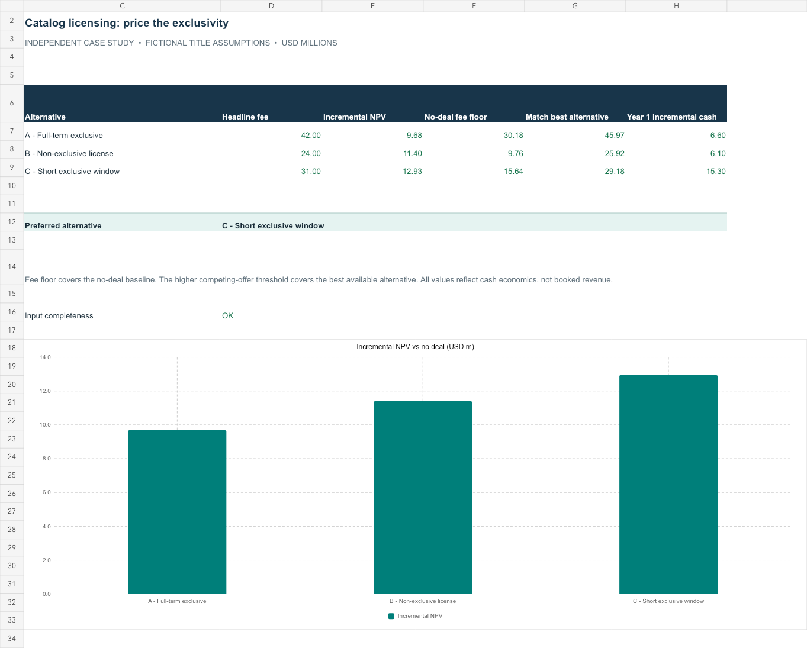

# Price the exclusivity: a TV catalog licensing decision

**Independent Sony Pictures FP&A case study · Excel + Python**

Three competing offers. One catalog. **Which contract creates the most value after accounting for the licenses it prevents?**

Sony's July 2026 outlook cited stronger TV catalog licensing in an upward revision to Pictures operating income. This project treats that as a commercial opportunity: support Business Affairs with incremental cash economics and defensible negotiation thresholds. [Public context](SOURCES.md)

> The package, offers, rights assumptions and financial outcomes are entirely fictional. This independent case study is not a Sony deal recommendation or a claim of access to Sony contract data.

## Review in 90 seconds

1. Read the [negotiation memo](EXECUTIVE_MEMO.md).
2. Download the [Excel decision model](financial-model.xlsx?raw=true); change blue inputs and watch the preferred offer update.
3. Inspect the [Python engine](model.py), [results](results/metrics.json) and [27-point deal sensitivity](results/sensitivity.csv).



## Baseline decision

| Fictional offer | Headline fee | Incremental NPV | Fee to match best alternative |
|---|---:|---:|---:|
| A — full-term exclusive | $42.00m | $9.68m | $45.97m |
| B — non-exclusive | $24.00m | $11.40m | $25.92m |
| C — short exclusive window | $31.00m | **$12.93m** | $29.18m |

Offer C wins the baseline despite a smaller fee than A. It protects more later catalog opportunity and collects cash earlier. Offer A needs approximately $45.97m under its existing payment schedule to match C's value. A price that merely beats “no deal” is not necessarily competitive with another available offer.

## What the project demonstrates

- Incremental NPV against the **same no-deal baseline** for all alternatives.
- Explicit rights retention and cannibalization assumptions instead of double-counting baseline revenue.
- Half-year cash timing, a time-zero delivery cost, and participation deductions.
- Two negotiation thresholds: no-deal break-even and best-alternative parity.
- Discount-rate and baseline-revenue sensitivities, including a no-deal recommendation when offers destroy value.
- A clear recommendation with operational and contractual conditions for Business Affairs.

These capabilities fit the deal-analysis and financial-presentation responsibilities in JR114637; Sony has not stated that applicants must complete this specific project.

## Run locally

Python 3.10+; standard library only.

```sh
python3 model.py
python3 -m unittest -v
```

The analysis generates the three offer outcomes plus sensitivities across 6%, 10% and 14% annual discount rates and 70%, 100% and 130% of baseline catalog cash. Seven tests validate fee floors, competitive thresholds, changing winners, walk-away cases and payment integrity.

The workbook independently implements the same baseline. Python edits do not overwrite Excel, and Excel edits do not rewrite JSON, the memo or the committed preview. See [methodology, rights scope and controls](MODEL_GUIDE.md).

Workbook NPVs and thresholds reconcile to Python. An offer-price change was tested to switch the recommendation, and invalid payment fractions were tested to expose a warning. Formula checks and visual review passed. Native Microsoft Excel execution was not tested.
